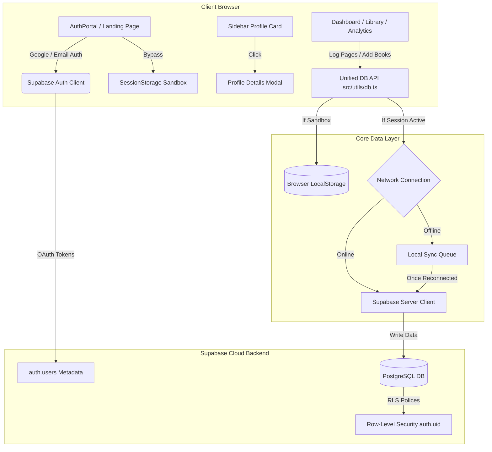

# BookVault


<div align="center">

# 📖 BookVault
### *Your Intelligent Digital Library & Reading Sanctuary*

[](https://nextjs.org/)
[](https://react.dev/)
[](https://www.typescriptlang.org/)
[](https://tailwindcss.com/)
[](https://supabase.com/)
[](https://vercel.com/)
[](LICENSE)

<p align="center">
  <a href="#-introduction">Introduction</a> •
  <a href="#-features">Features</a> •
  <a href="#-tech-stack">Tech Stack</a> •
  <a href="#-architecture">Architecture</a> •
  <a href="#-folder-structure">Folder Structure</a> •
  <a href="#-installation">Installation</a> •
  <a href="#-deployment">Deployment</a> •
  <a href="#-usage-guide">Usage Guide</a>
</p>

</div>

---

## 🌟 Introduction

**BookVault** is a premium, open-source reading tracking workspace designed to replace fragmented library tools. Combining the clean, aesthetic layout of Notion with the tracking depth of Goodreads, BookVault helps you organize your physical and digital books, log daily reading sessions, analyze reading speeds (Pages Per Minute), watch contribution heatmap calendars, and unlock gamified achievements.

Equipped with a **Dual-State Database Layer**, BookVault works completely offline-first using a local sandbox mode, queuing your data locally and automatically syncing with **Supabase Cloud Sync** once a network connection is established.

---

## 🚀 Features

### 🗂️ Personal Library & Wishlist
*   **Aesthetic Cataloging**: Display books using glassmorphic cards, custom gradient presets, or cover file uploads.
*   **Status Classification**: Organize books into *Not Started*, *Reading*, *Completed*, or *Wishlist*.
*   **Wishlist & Store Tags**: Log purchase prices, priority cues, and clickable online store links. Automatic "Move to Library" transitions recalculate cost tags instantly.

### 📊 Reading Logs & Analytics Dashboard
*   **Session Logger**: Log pages read today, record reading duration, and write notes.
*   **SVG Progress Rings**: Watch visual goal rings fill up in real time as you complete your daily page quotas.
*   **Recharts Analytics**: Inspect interactive weekly charts of pages read over time, monthly finished books, and average reading speeds.
*   **Contribution Heatmap**: A GitHub-style monthly calendar contribution grid tracking your daily reading logs.

### 🏆 Gamified Milestones & Streaks
*   **Streaks Tracker**: Keep track of consecutive reading days (Streaks) with active flame indicators.
*   **Achievement Badges**: Earn milestones like *Streak Master*, *Speed Demon*, *Bookworm I*, and *Deep Diver* based on reading speed and pages logged.

### 🔒 Authentication & Dynamic Profiles
*   **Secure Authentication**: Log in securely via Email/Password or Google OAuth (using Supabase Auth).
*   **Custom Meta Fields**: Registration form fields capture Full Name, Current Role, and DOB.
*   **Interactive Profile Modal**: Click your profile card in the sidebar to review your account details, registration metadata, and active sync settings.

### 📱 Responsive UI & Offline PWA Capabilities
*   **Collapsible Sidebar Navigation**: RETRACTS on tablet/mobile views for a clean workspace.
*   **Responsive layouts**: Tailored grids stack vertically on mobile; tables collapse into beautiful details feeds.
*   **PWA Installable**: Fully compatible with iOS Add to Home Screen and Android installation, supporting offline service caching.

---

## 📸 Screenshots Section

| Dashboard View (Dark Mode) | Library Catalog View |
|:---:|:---:|
|  |  |

| Contribution Heatmap | Account Profile Overlay |
|:---:|:---:|
|  |  |

---

## 🛠️ Tech Stack

| Technology | Role | Rationale |
|:---|:---|:---|
| **Next.js 15 (App Router)** | Core Framework | Server components, file-based routing, and SSR middleware cookie validation. |
| **React 19** | UI Layer | Reusable, responsive interface components and client-side hooks. |
| **TypeScript** | Type Safety | Robust types preventing compile-time bugs across database models. |
| **Tailwind CSS v4** | CSS Styling | Ultra-fast rendering utility classes, custom scrollbars, and modern gradients. |
| **Supabase** | Backend-as-a-Service | PostgreSQL database tables, authentication providers, and RLS policies. |
| **Framer Motion** | UI Transitions | Staggered fade-ins, slide-overs, and smooth mobile sidebar transitions. |
| **Recharts** | Interactive Analytics | Responsive SVG visualization of daily page logs and speed statistics. |
| **Lucide React** | Graphics Icons | High-quality, clean vector icon pack. |

---

## 📐 Architecture

This diagram illustrates how BookVault routes requests, synchronizes local state storage, and coordinates authorization between the client and Supabase.



---

## 📁 Folder Structure

```text
BookVault/
├── public/                       # Static graphics assets
│   ├── github_banner.png         # Repository Hero banner
│   └── manifest.json             # PWA app parameters configuration
├── src/
│   ├── app/                      # Next.js App Router Route tree
│   │   ├── auth/callback/        # OAuth code verification router
│   │   │   └── route.ts
│   │   ├── favicon.ico           # Default favicon
│   │   ├── globals.css           # Global CSS variables and Tailwind imports
│   │   ├── icon.png              # Custom tab book icon
│   │   ├── layout.tsx            # Root HTML body wrappers
│   │   └── page.tsx              # Main entry page dispatcher
│   ├── components/               # Core application modules
│   │   ├── Analytics.tsx         # Monthly statistics graphs
│   │   ├── AuthPortal.tsx        # Landing Page + Login modal overlay
│   │   ├── Badges.tsx            # Reading milestones logic
│   │   ├── BookForms.tsx         # Book metadata inputs
│   │   ├── CalendarView.tsx      # Heatmap calendar grid
│   │   ├── Dashboard.tsx         # Main activity log statistics
│   │   ├── History.tsx           # Session entries tables & mobile cards
│   │   ├── Library.tsx           # Book catalogs grid
│   │   ├── Notifications.tsx     # Toast notification adapter
│   │   ├── Sidebar.tsx           # Collapsible navigation panel
│   │   └── ThemeContext.tsx      # Dark / Light theme provider
│   ├── utils/                    # Data access engines
│   │   ├── db.ts                 # LocalStorage & Supabase API coordinator
│   │   └── supabase/             # Client, Server, and Middleware clients
│   │       ├── client.ts
│   │       ├── middleware.ts
│   │       └── server.ts
│   └── middleware.ts             # Global Next.js redirect middleware
├── supabase_schema.sql           # PostgreSQL Database Schema template
├── package.json
└── tsconfig.json
```

---

## ⚙️ Installation

### Prerequisites
*   [Node.js](https://nodejs.org/) (v18.0 or higher)
*   [npm](https://www.npmjs.com/) or [pnpm](https://pnpm.io/)
*   A [Supabase](https://supabase.com/) Account

### 1. Clone the Repository
```bash
git clone https://github.com/pruthvisb/BookVault.git
cd BookVault
```

### 2. Install Dependencies
```bash
npm install
```

---

## 🔑 Environment Variables

Create a `.env.local` file in the root of the project:

```env
NEXT_PUBLIC_SUPABASE_URL=https://your-project-ref.supabase.co
NEXT_PUBLIC_SUPABASE_PUBLISHABLE_KEY=your-publishable-key
```

Replace `your-project-ref` and `your-publishable-key` with the credentials found under **Settings** ➔ **API** in your Supabase dashboard.

---

## 🏃 Running Locally

To run the Next.js development server:

```bash
npm run dev
```

Open [http://localhost:3000](http://localhost:3000) in your web browser. 

> [!TIP]
> To test on mobile devices connected to the same Wi-Fi, run the server and access your laptop's local IP address (e.g. `http://192.168.1.100:3000`).

---

## 🗄️ Database Setup (Supabase)

To initialize your PostgreSQL tables in Supabase:

1. Open your project in the [Supabase Console](https://supabase.com).
2. Click the **SQL Editor** tab (terminal icon with `SQL`) on the left menu.
3. Click **`+ New query`**.
4. Copy the complete SQL commands inside the [`supabase_schema.sql`](file:///d:/books/supabase_schema.sql) file in this repository and paste them into the query editor.
5. Click **`Run`** in the bottom-right corner.

This creates the `books`, `reading_logs`, and `reading_goals` tables, sets up Row-Level Security (RLS) policies linking records to `auth.users(id)`, and creates index filters for query acceleration.

---

## 🌐 Deployment

### Deploy to Vercel (Recommended)
1. Push your code to your GitHub account.
2. Log in to [Vercel](https://vercel.com) and click **Import Project**.
3. Select your `BookVault` repository.
4. Add the environment variables (`NEXT_PUBLIC_SUPABASE_URL` and `NEXT_PUBLIC_SUPABASE_PUBLISHABLE_KEY`) in the project settings.
5. Click **Deploy**.

### Add Redirect URLs to Supabase
Under **Supabase Dashboard** ➔ **Authentication** ➔ **URL Configuration**:
1. Set the **Site URL** to your new Vercel deployment URL (e.g. `https://your-app.vercel.app`).
2. In the **Redirect URLs** whitelist, add: `https://your-app.vercel.app/auth/callback`.

---

## 📖 Usage Guide

<details>
<summary><b>1. Accessing Sandbox vs Cloud Sync</b></summary>
<br />
BookVault allows you to test the app instantly without signing up. 
*   **Sandbox**: Click **Try Sandbox Mode** on the landing page. All books, logs, and goals are stored in your browser session. Closing the tab automatically clears all session data, preventing local caching bloat.
*   **Cloud Sync**: Register for a free account. Your logs are synchronized securely to PostgreSQL. If you are offline, BookVault queues your changes and writes them back to the database as soon as you reconnect.
</details>

<details>
<summary><b>2. Logging Daily Reading Sessions</b></summary>
<br />
*   Open the Dashboard or click a book in your library.
*   Click **Log Session** to open the log form.
*   Enter the number of pages you read, select the duration (in minutes), and write optional notes.
*   If you reach the final page of a book, BookVault automatically flags its status as **Completed** and updates your yearly finished goal tally.
</details>

<details>
<summary><b>3. Customizing Your Profile Details</b></summary>
<br />
*   During signup, enter your **Full Name**, **Role / Occupation**, and **DOB**.
*   Inside the application, click on the profile card located in the sidebar to slide open the **Reader Profile Modal** overlay.
*   This lets you inspect your metadata parameters, current email, and active syncing credentials in a clean overlay card.
</details>

---

## 🗺️ Future Roadmap
- [ ] **OCR Cover Scanner**: Scan ISBN barcodes or book titles directly from your mobile camera to import details.
- [ ] **Data Export**: Support one-click CSV and JSON data exports for spreadsheet analysis.
- [ ] **Social Reading Clubs**: Create shared reading rooms with friends to sync current books and compare speeds.
- [ ] **Audiobook Support**: Log progress using hours/minutes read instead of page numbers.

---

## 🤝 Contributing

Contributions are welcome! Please follow these guidelines:
1. Fork the repository.
2. Create a feature branch: `git checkout -b feature/your-feature-name`.
3. Commit your changes: `git commit -m 'Add your feature description'`.
4. Push to the branch: `git push origin feature/your-feature-name`.
5. Open a Pull Request.

---

## 📄 License

This project is licensed under the MIT License - see the [LICENSE](LICENSE) file for details.

---

## ✍️ Author

*   **Pruthvi** - *Initial Creator & Lead Developer* - [@pruthvisb](https://github.com/pruthvisb)

---

## 💖 Acknowledgements
*   [Supabase SSR Package](https://github.com/supabase/ssr) for Next.js authentication cookies integration.
*   [Lucide React](https://lucide.dev) for the icon library assets.
*   [Framer Motion](https://www.framer.com/motion/) for fluid page transitions.
